# csnake

## A) Hướng dẫn commit code:

```text
1. Tích hợp email uit vào tài khoản github và chuyển thành email chính như hình:

login github >> click avatar >> setting >> email >> add email
>> nhập email của bạn >> click add >> chọn email vừa thêm làm primary
```
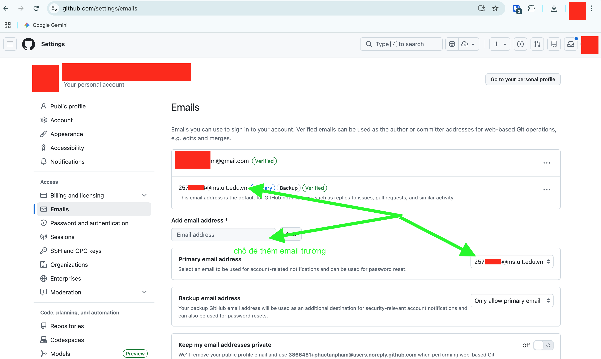

```text
2. Chạy lệnh sau để cấu hình:
   - git config --global user.name "MSSV"
   - git config --global user.email "MSSV@ms.uit.edu.vn"
```
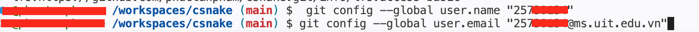

```text
3. tạo branch mới để làm việc:
   - git checkout -b MSSV/tên_branch
```
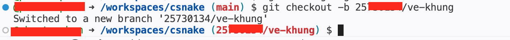

```text
4. kiểm tra branch hiện tại đang làm việc:
   - git branch
```
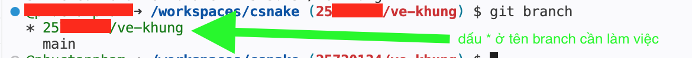

```text
5. Kiểm tra trạng thái file đã thay đổi:
   - git status
```
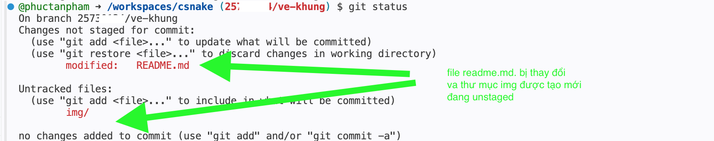

```text
6. chạy lệnh sau để commit code (nên add từng file một để dễ kiểm soát thay vì chạy "git add ." hoặc "git add -A" để add tất cả file đã thay đổi):
   - git add tên_file_cần_commit
   - git commit -m "MSSV: Nội dung commit"
```
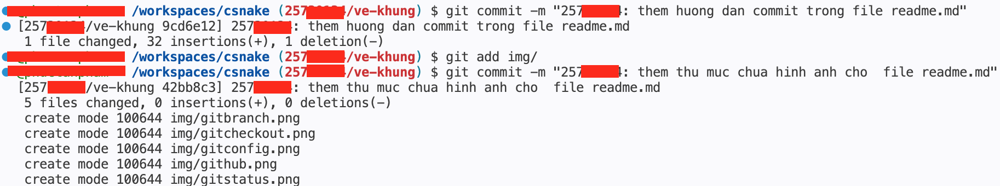

```text
7. Kiểm tra lại bằng lệnh git status để chắc chắn unstaged files --> staged files đã được commit hết rồi mới đẩy code lên github.
```
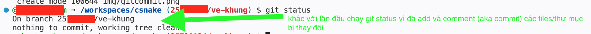

```text
8. đẩy code lên github:
   - git push origin MSSV/tên_branch
```
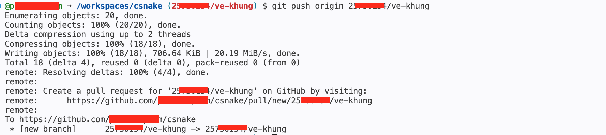


## B) Hướng dẫn tạo PR và merge vào branch main:

```text
1. Truy cập vào trang GitHub của repository. Sau khi push code, bạn sẽ thấy thông báo nhánh mới vừa được đẩy lên. Bấm vào nút "Compare & pull request" để tạo PR.
```
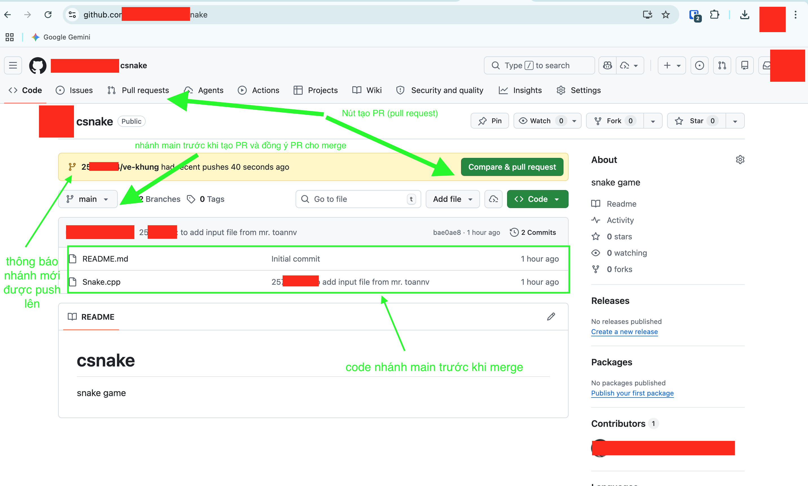

```text
2. Trong trang mở ra, thực hiện các bước cấu hình sau:
   - Kiểm tra lại nhánh: chọn merge từ nhánh của bạn (compare) vào nhánh chính (base: main).
   - Thêm/thay đổi tiêu đề (nếu cần, thường để mặc định là tên nhánh).
   - Viết mô tả ngắn gọn các tính năng mới hoặc thay đổi vào khung Description.
   - Chỉ định người review code (Reviewers) và người bị review (Assignees).
   - Nhấn nút "Create pull request".
```
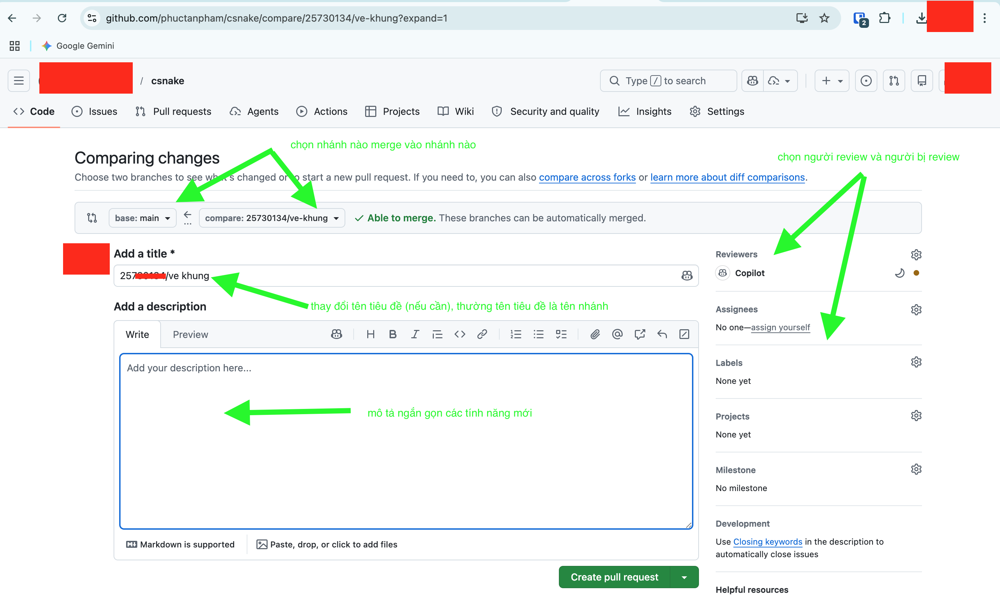

```text
3. Xem lại PR vừa tạo. Bạn có thể trao đổi thêm hoặc bổ sung mô tả ở phần comment. Khi code đã được review và hiển thị trạng thái xanh (Ready to merge) thì có thể chuẩn bị gộp code. Bấm chọn vào ô "Merge pull request" để tiến hành gộp.
```
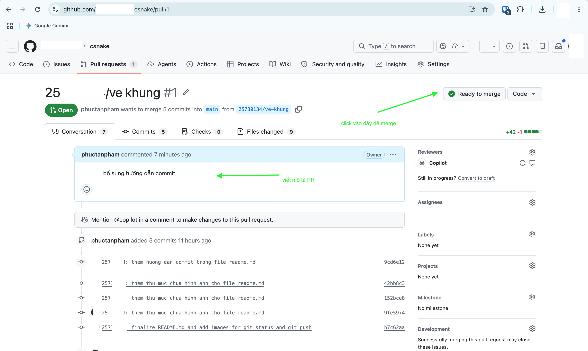

```text
4. Khuyến khích nhấn vào mũi tên xổ xuống cạnh nút "Merge pull request" và chọn "Rebase and merge" để giữ lịch sử commit gọn gàng, sau đó nhấn nút xác nhận để hoàn tất quá trình đưa code vào nhánh main.
```
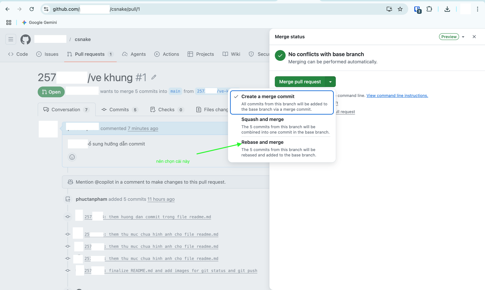
