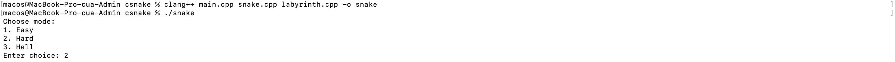
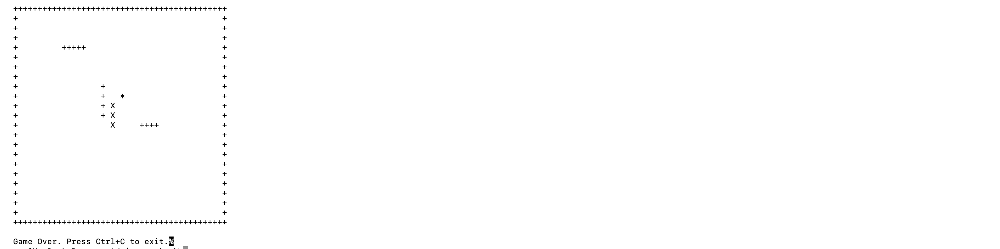

## A/ Setup to play
1) Chạy lệnh sau để tạo file snake

```
clang++ main.cpp snake.cpp labyrinth.cpp -o snake

```
2) Chạy file snake vừa tạo

```
./snake

```
3) Chọn chế độ chơi và bắt đầu chơi





## B/ Information Credit
Original Author:
- Nguyễn Văn Toàn (UIT.19529999)
- Repo: https://github.com/toannv-uit/Snake/

Contributors:  
- Phạm Tấn Phúc (25730134)
- Tạ Minh Trường (25730157)
- Ngô Triều Vĩ (25730160)

Contribution:
  -  Refactor the original codebase into OPP for snake and labyrinth.
  -  Upgrade more barriers with multi gameplay mode.
  -  Conceptualize the labyrinth
